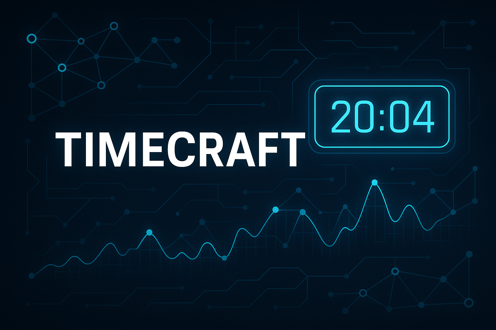

# 

## Welcome to TimeCraft

---

**An advanced solution for time series analysis, database integration, and task automation, with dynamic notifications and a powerful CLI.**

TimeCraft is designed to streamline your workflow by integrating time series data with databases, automating tasks, and providing real-time notifications. It features a robust command-line interface (CLI) for efficient management and execution of tasks.

---

For complete documentation, see [README](README.en) or the [Portuguese version](README.pt-BR).

---

## Contact

- **Developer**: [Rafael Mori](mailto:faelmori@gmail.com)  
- [GitHub](<https://github.com/rafa-mori/timecraft>) | [LinkedIn](<https://www.linkedin.com/in/rafa-mori>)
- [Twitter](<https://twitter.com/faelOmori>) | [Gravatar](<https://rafamori.pro>)
